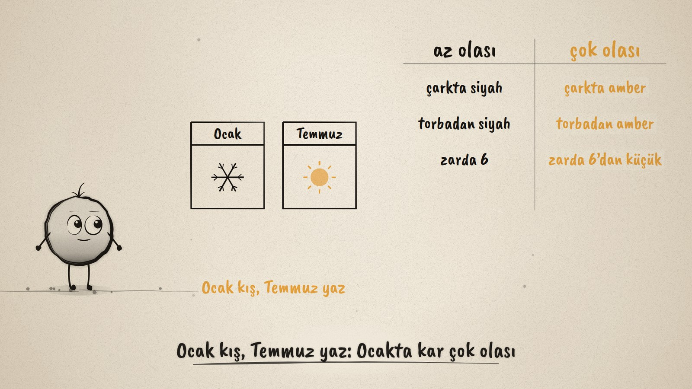
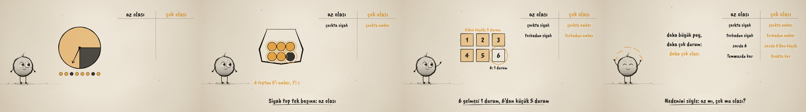

# Hangisi Daha Olası? · Which Is More Likely?

**▶ Tarayıcıda izleyin / Watch in the browser:** https://hakanatas.github.io/hangisi-daha-olasi/ 
**⬇ MP4 + altyazılar / MP4 + subtitles:** [Releases](https://github.com/hakanatas/hangisi-daha-olasi/releases) 
**✎ Kullanılan istem / The prompt behind it:** [PROMPT.md](PROMPT.md) 
**🎞 Bütün filmler / All films:** [Nokta'nın Filmleri](https://hakanatas.github.io/nokta-filmleri/)

> **TR —** 5. sınıf matematik "Veriden Olasılığa" temasındaki MAT.5.6.2 öğrenme çıktısı için hazırlanmış, tamamen JavaScript ile çizilen 92 saniyelik mürekkep animasyonu. Nokta olayları "az olası" ve "çok olası" diye iki sütunlu bir tahtaya yerleştiriyor ve her seferinde nedenini söylüyor. Çark: amber bölge dörtte üç, 8 dönüşte 6 amber geliyor; amberde durmak çok olası, siyahta durmak az olası. Torba: 6 toptan 5'i amber, 1'i siyah. Zar: 6 gelmesi 1 durum, 6'dan küçük gelmesi 5 durum. Bildiklerimiz: Ocak kış, Temmuz yaz; Ocakta kar yağması çok olası, Temmuzda az olası. Film "Daha büyük pay, daha çok durum: daha çok olası" cümlesiyle bitiyor. Altyazılar Türkçe, İngilizce ya da ikisi birlikte seçilebilir.

A 92-second ink animation for **5th-grade maths**, drawn entirely with JavaScript on an HTML5 canvas. It is the second and last film of the *Veriden Olasılığa* theme, after [İmkânsızdan Kesine](https://github.com/hakanatas/imkansizdan-kesine), and the last film of the 5th-grade series. Nokta, the ink character from [The Learning Ink](https://github.com/hakanatas/the-learning-ink), is the guide again.

## Learning outcome

MEB, Türkiye Yüzyılı Maarif Modeli, Ortaokul Matematik, 5th grade, "Veriden Olasılığa" theme:

**MAT.5.6.2. Olayları az ya da çok olasılıklı şeklinde yapılandırabilme**
- a) Olayların olasılıklarına ilişkin nedensel veya mantıksal ilişkiler ortaya koyar.
- b) Kendi öz bilgisi ile elde ettiği ilişkilere dayanarak olayların olasılıklarını az veya çok olasılıklı şeklinde ortaya koyar.

## Scenes

| # | Time | Scene | What happens | Outcome |
|---|---|---|---|---|
| 1 | 0–10 s | Hangisi daha olası? | A spinner, mostly amber with a small black part. | Intro |
| 2 | 10–30 s | Çark | A board: az olası / çok olası. 8 spins: 6 amber, 2 black. The amber part is bigger, so amber is more likely. | a |
| 3 | 30–48 s | Torba | 6 balls: 5 amber, 1 black. The black ball is alone: less likely; amber is more likely. | a |
| 4 | 48–66 s | Zar | Rolling a 6 is 1 outcome; less than 6 is 5 outcomes. More outcomes: more likely. | a |
| 5 | 66–80 s | Bildiklerimiz | Snow in January or July? January is winter, July is summer. | b |
| 6 | 80–92 s | Aklında kalsın | "Daha büyük pay, daha çok durum: daha çok olası." Say why. Nokta celebrates. | a, b |

## Running it

- **Preview:** double-click `index.html` (it works offline).
- **MP4:** run `npm install` once, then `npm run export -- --format=horizontal --captions=tr`.
- **Subtitles and narration:** `npm run srt` writes `out/captions_*.srt` and `narration_notes.txt`.
- **Editing:**
  - Caption text, timings and narration notes: `captions.js`
  - Everything on screen is drawn by `LI.world(t)` in `scenes/scene1.js` (spinner, bag, die, months, the sorting board, the rule); the other scenes only set the camera.
  - Spin results (`SPINS`, `FINAL`), board pairs (`PAIRS`), the bag drawing and Nokta's poses: `src/draw/film.js`; layout for 16:9 and 9:16: `src/draw/kd.js`

It uses the same engine as The Learning Ink: `renderFrame(t)` as a pure function of time, seeded randomness, and frame-by-frame export.

## Lisans · License

**TR —** Bu film ve kodu [Creative Commons Atıf-GayriTicari 4.0 Uluslararası (CC BY-NC 4.0)](https://creativecommons.org/licenses/by-nc/4.0/deed.tr) lisansıyla paylaşılır. Ticari olmayan her amaçla (derste, okulda, eğitim materyalinde) kopyalayabilir, paylaşabilir ve değiştirebilirsiniz; ancak **kaynak göstermek zorunludur**: eser sahibinin adı ve bu deponun bağlantısı belirtilmeden kullanılamaz. Ticari kullanım (satış, ücretli ürün ya da yayın) için izin alınmalıdır.

**EN —** This film and its code are licensed under [Creative Commons Attribution-NonCommercial 4.0 International (CC BY-NC 4.0)](https://creativecommons.org/licenses/by-nc/4.0/). You may copy, share and adapt them for non-commercial purposes, but **attribution is required**: they may not be used without crediting the author and linking to this repository. Commercial use requires permission.

Atıf örneği / Required credit: *“Hangisi Daha Olası?”, Hakan Ataş, Nokta'nın Filmleri — https://github.com/hakanatas/hangisi-daha-olasi — CC BY-NC 4.0*
